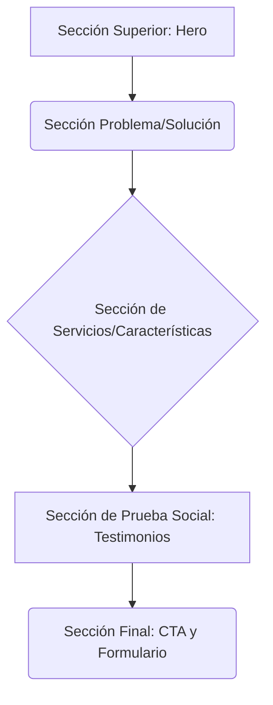

# ALQUIMIA Software

Transforming Ideas into Innovation.

---

## Menú de Navegación

* [Hero Section](#1-sección-superior-hero-section)
* [Problema/Solución](#2-sección-de-problemasolución)
* [Servicios/Características](#3-sección-de-servicioscaracterísticas)
* [Testimonios](#4-sección-de-prueba-social-testimonios)
* [CTA y Formulario de Contacto](#5-sección-final-cta-y-formulario-de-contacto)

---

## Descripción del Proyecto

### Enfoque Innovador y de Transformación (Recomendado)

En Alquimia Software, nos especializamos en destilar ideas complejas en soluciones de software innovadoras y de alto rendimiento. Nuestra misión es la transformación digital: fusionamos la ciencia de la programación con la experiencia de usuario para crear aplicaciones robustas y escalables. Más que código, creamos el futuro digital de nuestros clientes, garantizando siempre un servicio al cliente excepcional y personalizado.

### Enfoque Profesional y Directo

Alquimia Software es una firma dedicada al desarrollo de soluciones tecnológicas personalizadas y a la excelencia en el servicio al cliente. Proporcionamos un stack tecnológico completo, desde consultoría y desarrollo web/móvil hasta mantenimiento continuo. Nuestro compromiso es entregar valor real y medible a través de software de calidad superior, optimizando procesos y maximizando el retorno de inversión de nuestros socios comerciales.

### Enfoque "Alquímico" y Creativo

Tal como los antiguos alquimistas buscaban la perfección, en Alquimia Software transformamos tus materias primas—tus ideas y desafíos—en oro digital. Utilizamos metodologías ágiles y las últimas tecnologías para crear software que no solo funciona, sino que evoluciona con tu negocio. A través de un servicio al cliente dedicado, nos aseguramos de que cada proyecto sea una obra maestra de eficiencia e innovación.

---

## Paleta de Colores "Circuito Alquímico"

Esta paleta se basa en los colores de tu logo para asegurar consistencia de marca.

| Nombre | Código Hex | Uso Principal (Regla 60-30-10) |
| :--- | :--- | :--- |
| **Fondo Oscuro** | `#1A1A1D`  | Color dominante (60%). Perfecto para un tema oscuro que hace que los colores neón resalten y da un toque premium/tecnológico. |
| **Verde Neón** | `#39FF14` | Color secundario (30%). Usado para títulos y secciones principales. Representa crecimiento y vitalidad. |
| **Azul Eléctrico** | `#00BFFF` | Color de acento (10%). Ideal para botones de llamada a la acción (CTA) y elementos interactivos, ya que llama la atención y sugiere confianza. |
| **Texto Claro** | `#F5F5F5` | Color base para todo el texto principal, asegurando alta legibilidad sobre el fondo oscuro. |

---

## Estructura de la Landing Page

Una estructura de landing page efectiva se centra en convertir visitantes en clientes potenciales (leads).

### 1. Sección Superior (Hero Section)

* **Objetivo:** Captar la atención inmediatamente y comunicar la propuesta de valor.
* **Contenido:**
  * **Logo** y navegación simple.
  * **Titular Principal:** Grande, usando el color Verde Neón, por ejemplo: "**Transformando Ideas en Innovación**".
  * **Subtítulo:** Una breve descripción de 1-2 líneas.
  * **Botón CTA:** "Solicitar Consulta Gratuita" o "Ver Servicios".
  * **Elemento Visual:** Tu logo en grande o una animación sutil.

### 2. Sección de Problema/Solución

* **Objetivo:** Identificar los puntos débiles del cliente y posicionar tu software como la solución.
* **Contenido:**
  * Título: "¿Tienes estos desafíos con tu software actual?".
  * Lista de problemas comunes (usando íconos).

### 3. Sección de Servicios/Características

* **Objetivo:** Detallar los servicios que ofreces (Desarrollo, Consultoría, Mantenimiento, etc.).
* **Contenido:**
  * Diseño de cuadrícula (grid) con tarjetas para cada servicio.
  * Cada tarjeta debe tener un ícono relevante, un título claro y una breve descripción.

### 4. Sección de Prueba Social (Testimonios)

* **Objetivo:** Generar confianza y credibilidad.
* **Contenido:**
  * Citas de clientes satisfechos.
  * Logos de empresas con las que has trabajado (si aplica).

### 5. Sección Final (CTA y Formulario de Contacto)

* **Objetivo:** Impulsar la conversión final.
* **Contenido:**
  * Un título claro como: "**Empecemos tu proyecto**".
  * Un formulario simple (nombre, correo, mensaje) para capturar leads.
  * Botón CTA final.
